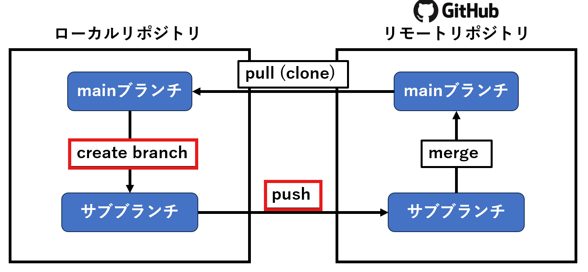
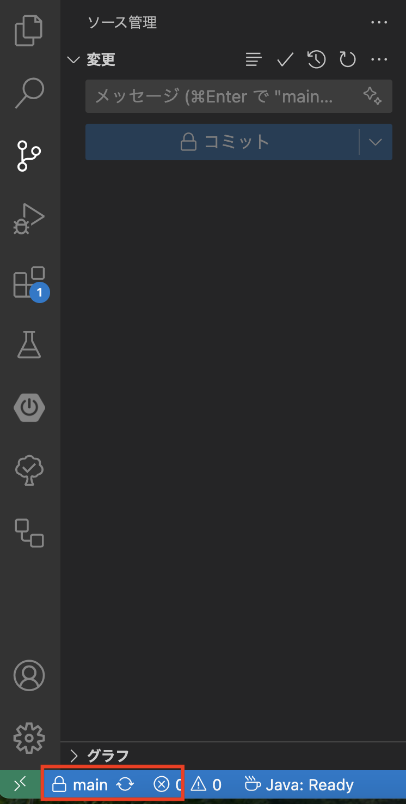
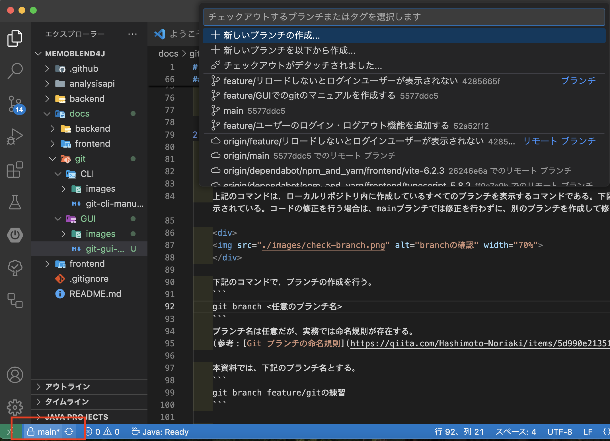
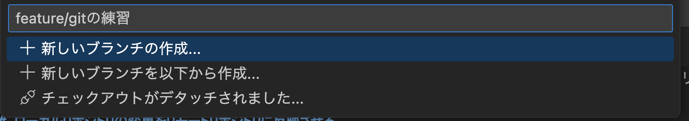
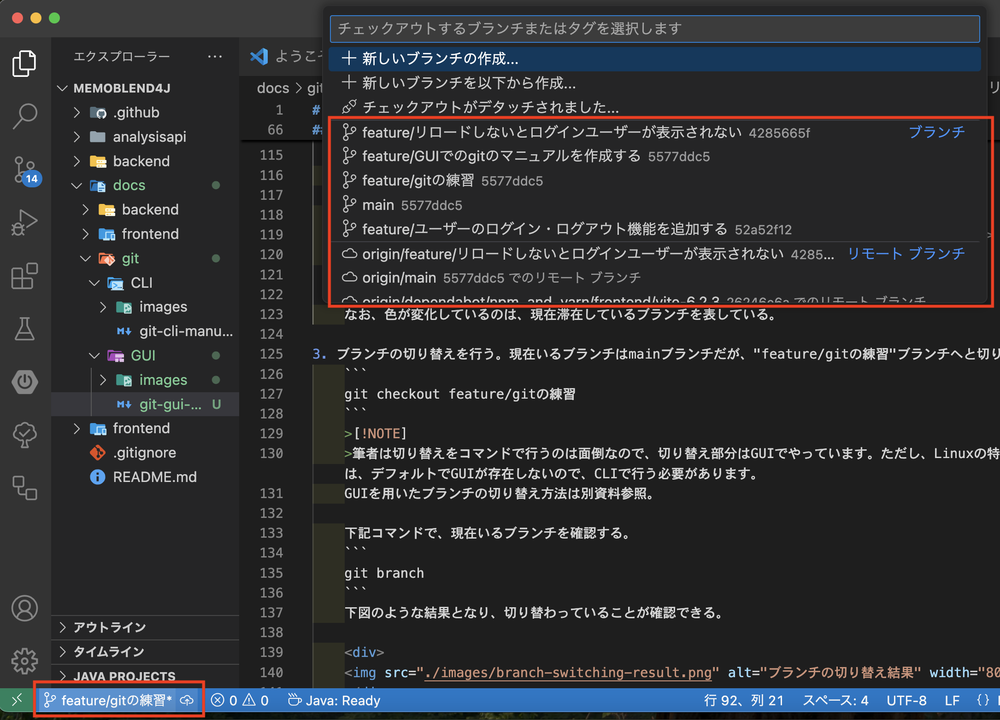
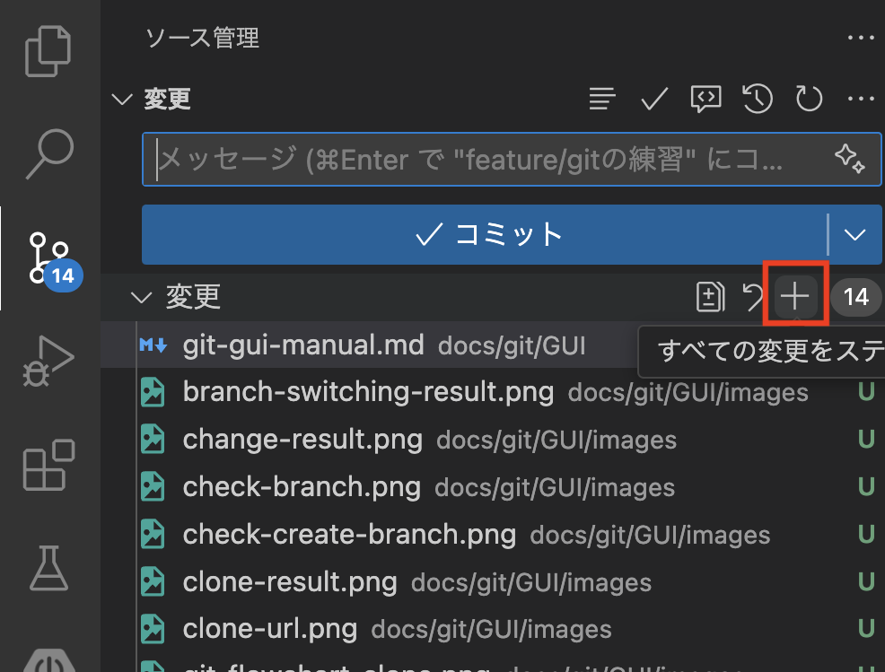
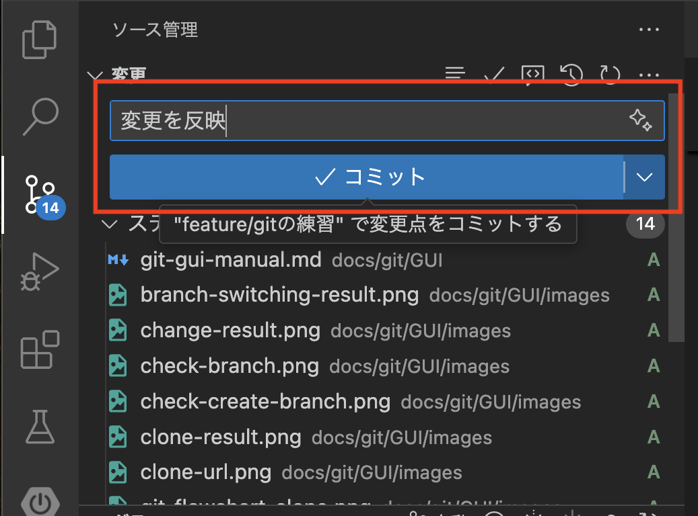
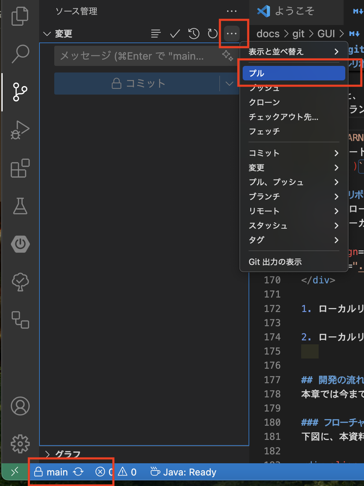

# GUIでのgitのマニュアル
本資料では、下図のような基本的なgitの流れを理解することを目的として作成している。
下図の**ローカルリポジトリ**と**リモートリポジトリ**の関係を意識して資料を読み進めていただきたい。

<div align="center">

</div>

## 対象
本資料は、以下をすべて満たす方を対象として作成している。
- [ ] OSは、windows11を使用。MacやLinuxは未検証のため、適宜読み替えていただきたい。
- [ ] VSCodeの環境構築が済んでいる。
- [ ] gitの環境構築が済んでいる。行っていない場合は、[Gitのインストール方法(Windows版)](https://qiita.com/T-H9703EnAc/items/4fbe6593d42f9a844b1c)を参考にして設定する。
- [ ] すでにGitHub上に公開鍵をアップしており、秘密鍵を持っている状態である。
まだ行っていない場合は、[GitHubでssh接続する手順\~公開鍵・秘密鍵の生成から\~](https://qiita.com/shizuma/items/2b2f873a0034839e47ce) を参考にして設定する。

## ローカルリポジトリの管理下設定
本章では、GitHub上にすでに作成されているリポジトリを、新たに作成したローカルリポジトリにコピーするまでの手順を説明する。

<div align="center">

</div>

GitHubに存在するリモートリポジトリと、ローカルPC上に存在するローカルリポジトリを連携させるためには、まずはローカルPC上の特定のフォルダをgitの管理下にする必要がある。

1. 管理下におきたいリポジトリでVSCodeを開く。本資料では、下図のリポジトリで作業を行う。

    <div>
    
    </div>

    また、VSCodeの起動をCLIで行いたい場合は、下記コマンドを実行する。

    ```cmd
    cd <リポジトリにしたいフォルダのパス>  # 階層の移動
    code .  # VSCodeの起動
    ```

2. 下記のコマンドで、フォルダをgitの管理下に設定する。
    ```cmd
    git init
    ```
    実行すると、下図のように".git"フォルダが作成される。この".git"フォルダがローカルリポジトリの管理人の居場所である。

    <div>
    
    </div>

3. 下記のコマンドで、GitHub上のMemoBlendのリポジトリ(リモートリポジトリ)をローカルリポジトリにコピーする。これを"クローン"と呼ぶ。

    ```cmd
    git clone git@github.com:ohiaeni/MemoBlend4J.git
    ```

    なお、`git@github.com:ohiaeni/MemoBlend4J.git`については、下図に示す箇所から確認できる。
    
    "Code" -> "SSH" 

    <div>
    
    </div>

    クローンが正常に実行できた場合、下図のように表示される。

    <div>
    
    </div>

## ローカルリポジトリの変更をリモートリポジトリに反映させる
ローカルリポジトリで作業を行うとファイルの変更が生じる。しかし、リモートリポジトリにはファイルの変更は自動で反映されない。本章では、その変更をリモートリポジトリに反映させるための手順を紹介する。

<div align="center">

</div>

1. 前章の"ローカルリポジトリの管理下設定" でcloneしたMemoBlendフォルダに移動し、VSCodeで開きなおす。

    ```cmd
    cd .\MemoBlend4J\
    code .
    ```

2. ブランチの作成を行う。まず、下記のコマンドで現在作成されているブランチを確認する。
    ```cmd
    git branch
    ```
    すると、下図のように表示される。
    上記のコマンドは、ローカルリポジトリ内に作成しているすべてのブランチを表示するコマンドである。下図では、mainブランチのみが表示されている。コードの修正を行う場合は、mainブランチでは修正を行わずに、別のブランチを作成して修正を行う。

    <div>
    
    </div>

    下記で、ブランチの作成を行う。
    まず、左下のmainをクリックする。すると、画像のようにメニューが開くので、上部の入力欄に作成するブランチの名前を明記する。

    <div>
    
    </div>

    ブランチ名は任意だが、実務では命名規則が存在する。
    (参考：[Git ブランチの命名規則](https://qiita.com/Hashimoto-Noriaki/items/5d990e21351b331d2aa1))

    本資料では、下記のブランチ名とする。

    <div>
    
    </div>
    
    もし、ブランチを削除したい場合は、下記コマンドを実行する。

    ```
    git branch -d feature/gitの練習
    ```

    削除時にエラーが発生した場合は、削除対象のブランチ名が間違っていないかをよく確認したうえで、下記コマンドを実行してください。

    ```
    git branch -D feature/gitの練習
    ```

    >[!NOTE]
    >-d と -D の違いとしては、削除対象のブランチがmergeされているかの確認が入るか否かの違いです。mergeについては、本資料の最後に少しだけ触れています。現時点では、まずは "-d" で削除を実行し、エラーが発生した際は削除するブランチ名を良く確認してから、"-D" を実行してください。

    先ほどのコマンドでブランチが作成できているか確認する。

    <div>
    
    </div>

    なお、色が変化しているのは、現在滞在しているブランチを表している。

3. 先ほどのブランチの作成手順で「feature/gitの練習」に切り替わっているが、ここではGUIによるブランチの移動方法を説明する。ブランチを切り替える際には、画像の左下の現在いるブランチをクリックする。すると、メニューが開くので、ブランチの一覧から、移動したいブランチを選択する。

    <div>
    
    </div>

4. ローカルリポジトリ内のファイルの変更を行い、リモートリポジトリに反映させる。まずは、下図のように、git管理下のフォルダ内(ローカルリポジトリ内)で適当なファイル(例としてhello.txt)を作成する。すると、赤枠で囲った箇所が変化する。

    <div>
    
    </div>

5. 上記は、ローカルリポジトリのみの変更であり、リモートリポジトリには変更が反映されていない。厳密に言うと、変更したのはフォルダのみであり、ローカルリポジトリでの変更を行えていない。例えると、ローカルリポジトリを管理している管理人に変更を伝えていないようなものである。変更を伝えるファイルを選択し、画像のプラスボタンをクリックする。

    <div>
    
    </div>

次に、管理人に変更内容を伝える。これを"コミット"と呼ぶ。文章は任意だが、例として下記内容でコミットする。
    <div>
    
    </div>

ここまでで、ローカルリポジトリの変更を行うことができる。しかし、リモートリポジトリには、変更をまだ伝えていない。下記コマンドでローカルリポジトリの変更内容を、リモートリポジトリの管理人に伝える。これを"プッシュ"と呼ぶ。「コミット」という文言が「変更の同期」または「ブランチの発行」に変化するので、そのボタンをクリックしてプッシュする。すると、リモートリポジトリにも"feature/gitの練習"ブランチが作成され、ローカルリポジトリの"feature/gitの練習"ブランチの変更内容が伝えられる。

    >[!WARNING]
    >リモートリポジトリのmainブランチにはpushしないでください。
    >ex. )`git push origin main` はNG。

## リモートリポジトリの変更をローカルリポジトリに反映させる
前章では、ローカルリポジトリの変更をリモートリポジトリに反映させる手順を述べた。本章では、その逆のリモートリポジトリの変更をローカルリポジトリに反映させる手順を述べる。

<div align="center">

</div>

ローカルリポジトリのmainブランチに、リモートリポジトリのmainブランチを反映させる。これを"プル"と呼ぶ。まず、画像左下のボタンからmainブランチにチェックアウトする。その後、画像の3点リーダーを選択し、メニューを表示させる。そこからプルを選択する。

<div>
    
</div>

## 開発の流れ
本章では今までの章を踏まえて、本資料の目的である、gitを用いた開発の大まかな流れを述べる。

### フローチャート
下図に、本資料の冒頭で紹介したフローチャートを再掲する。

<div align="center">

</div>

### 手順
コマンドベースの開発の手順を述べる。

1. 初めてローカルリポジトリと、リモートリポジトリを連携させる場合。

    リモートリポジトリのcloneを行う。
    ```
    git clone <省略>
    ```

2. 初めてではない場合、リモートリポジトリのmainブランチの最新の状態を、ローカルリポジトリのmainブランチへと反映させる。

<div>
    
</div>

3. ローカルリポジトリのmainブランチから、"feature/<任意の名前>"ブランチを作成する。

    <div>
    
    </div>

4. ローカルリポジトリの変更をリモートリポジトリに反映させる。
    <div>
    
    </div>

5. GitHub内で、pushされたブランチを作成者以外のレビュアーが確認する。確認が終われば、リモートリポジトリのmainブランチに変更が反映される。これを"マージ"と呼ぶ。